### 开关电源芯片
* TOP247YN  开关电源芯片  [手册](https://atta.szlcsc.com/upload/public/pdf/source/20140319/1457707022426.pdf?Expires=4070880000&OSSAccessKeyId=LTAIJDIkh7KmGS1H&Signature=y7e%2BXaVr%2FMlYrFWdXLxVRZK94nc%3D&response-content-disposition=attachment%3Bfilename%3DC24583_TOP247YN_2014-03-19.PDF)
* TOP246  开关电源设计 [](https://wenku.baidu.com/view/f42b8d630b1c59eef8c7b402.html)
* TOP234YN  
* TOP222Y    是一款三端脉宽宽度调制式（PWM）开关型稳压集成电路（IC） TOP223－227与TOP222Y的截断电流数值基本相同，耐压都为700V，开关频5261率都可达110KHZ，因为TOP223－227与TOP222Y进行代换在参数上面相对合适
* STR-G6351    电源模块  其他的资料未知  电源单排5,7,9脚STRG6351
* 1H0280R      增强型 全新原装 KA1H0280R 定型脚 30W开关电源芯片800V 1H0280R
* 1M0380R      [四端离线式PWM开关集成块参数](https://www.520101.com/html/circuitry/151824188.html)   

````
概述：该集成块是四端离线式PWM开关，又称FPS（Fairchild Power Switch)，其工作频率67KHz, 
内部具有过载、过压保护功能，有欠压锁定功能、软启动功能。内含大功率开关管，漏极耐压800V，
可直接连到电源脉冲变压器初级，次级输出受控的直流电压。

1M0380R引脚功能
1.GND 地
2.Drain 漏极
3.VCC 电源
4.FB 反馈
````

### 三极管

* D304X     TO-220封装NPN功率三极管，12A、400V、100W， 主要用于dao 180W-230W的电脑ATX电源版等。
* MJE 13005
``` 
MJE13005详细参数有：
集电极-基极最高反向耐copy压VCBO：700V
集电极-发射极最高反向耐压VCEO：400V
发射极-基极最高反向耐压VEBO：9V
集电极最大允许电流ICM：5A
集电极最大耗2113散功率PCM：75W
最高工作结温TJM：150℃
贮存温度TSTG：-65~150℃
集电极-基极截止电流ICBO：100μA (VCB=700V)
```
* H1061  [N 50V 3A 25W](https://wenku.baidu.com/view/4403cf3a3968011ca300913e.html)

### 稳压芯片 可调

* LM7805
  * 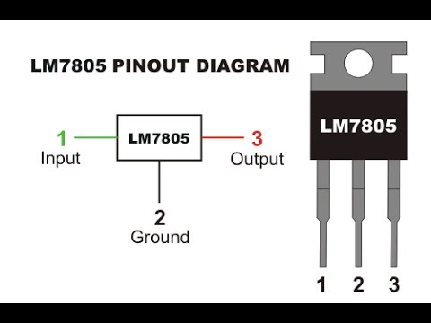
* LM317     
  * 1.5A 可调稳压输出芯(1:ADJ, 2:Vout, 3:Vin)
  * Vo/(R1+R2)>1.5mA, R1<=0.83KΩ, R2<=23.74KΩ
  * [参考](https://baike.baidu.com/item/LM317/7208866?fr=kg_general)
  * 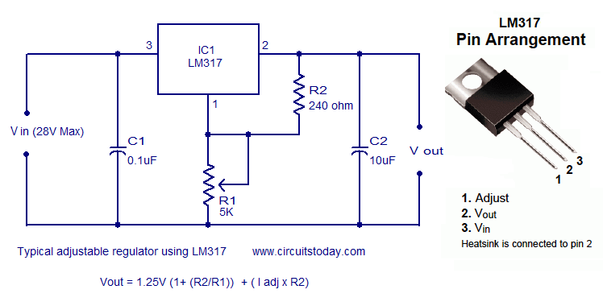
* LM337     
  * 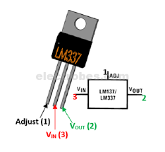
  * 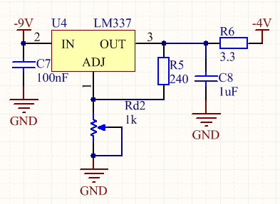
* LM317-LM337     
  * 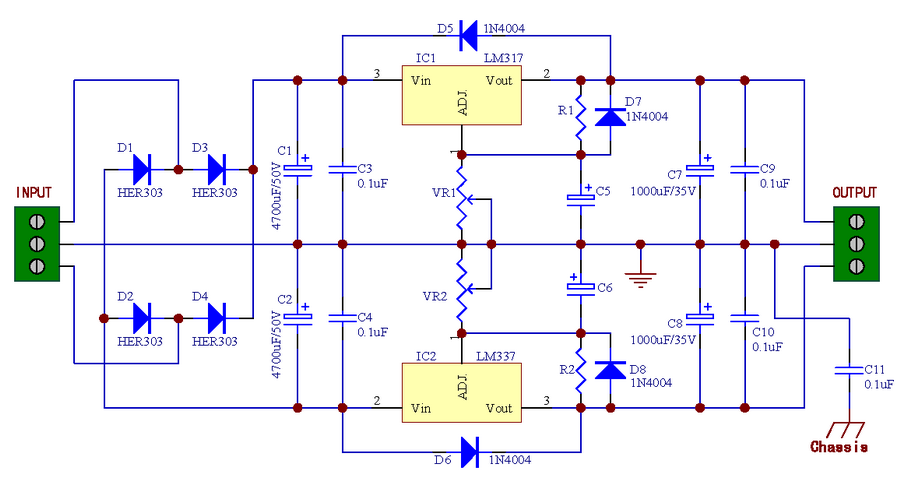
  * 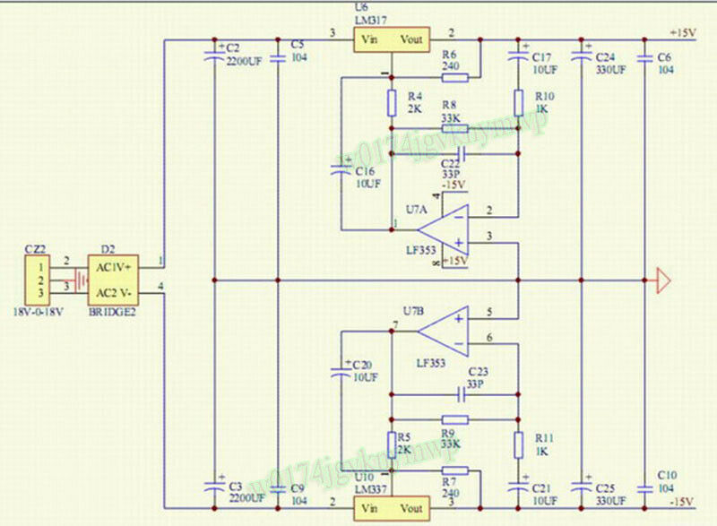
  * 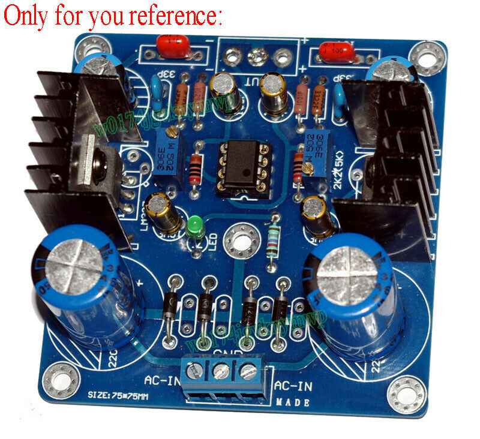
* LM1085    可调降压稳压芯片 3A， 引脚与LM317相同 
  * 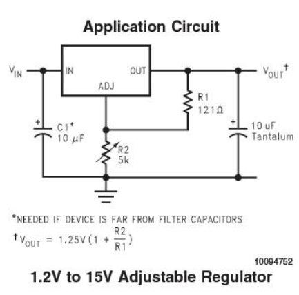
  * [参考文件1](./lm1085-01.pdf)
  * [参考文件2](./lm1085-02.pdf)
  * [参考](https://wenku.baidu.com/view/b5319975a26925c52cc5bf92.html)
* LM2596    可调电压稳压芯片 3A [Baidu](https://wenku.baidu.com/view/681f1172f242336c1eb95e3d.html?fr=search)  [CN PDF](./lm2596cn.pdf)
* L4940V12 -  [IC REG LDO 12V 1.5A TO220AB 芯片, 稳压器 低压差 +12V](https://html.alldatasheetcn.com/html-pdf/22477/STMICROELECTRONICS/L4940V12/1622/1/L4940V12.html)
* PQ05RD11    [是一块5V四端可控稳压集成电路 2A](https://tech.hqew.com/circuit_1465311)  https://wenku.baidu.com/view/089e90787fd5360cba1adb4d.html
* PQ30RV11   [ RV 11 代表1A， RV 21 代表2A]()
* [L4925N(92B222 SING)](https://pdf1.alldatasheetcn.com/datasheet-pdf/view/22465/STMICROELECTRONICS/L4925.html)
  L4925是单片集成的5V电压具有非常低的输出和附加功能的调节器，如上电复位和可编程复位延迟时间。它是为提供微机控制系统，特别是在汽车应用中。
* [FK10KM(10 1310) 10A 450v](https://pdf1.alldatasheetcn.com/datasheet-pdf/view/304/MITSUBISHI/FK10KM-9.html)
* [2SK2382](./2SK2382.pdf)

###  二极管整流器

* STPR1020CT       30A 45V 肖特基二极管，那两个引脚是A，剩下的是K
* BYV32E-150-200   200V, 2x10A 
* PBYR2545CTB      [40V 30A](https://pdf1.alldatasheetcn.com/datasheet-pdf/view/18089/PHILIPS/PBYR2545CTB.html)

### N- 场效应管

* 9N60是场效应管，技术参数为9.5A/600V，代换：IRFPC50，BUZ334。
* 2SK 1118       东芝出的 600V20A N型 mos管[查看](./2SK1118.pdf)
* 2SK 2391       东芝出的 100V20A N型 mos管 to-220塑封 可以用来替代的型号 IRF530N IRF540N IRF371都可以 [DataSheet](https://html.alldatasheetcn.com/html-pdf/348016/TOSHIBA/2SK2391/594/2/2SK2391.html)
* CEFF640       [9.8A 200V Vg10v 180欧姆](https://html.alldatasheetcn.com/html-pdf/57771/CET/CEFF640/46/1/CEFF640.html)
* KHB7D0N80F    N沟道7A 800V
* SPP11N80C3_05   [800v 0.45Ω 11A](https://wenku.baidu.com/view/3448ae1e0b4e767f5acfce0b.html)
* IRLI3615      [](https://pdf1.alldatasheetcn.com/datasheet-pdf/view/97308/IRF/IRLI3615.html) , [PDF](./IRLI3615.pdf)
* IRFxxxx
  * IRF2907Z      [75v 4.5mΩ 75A](https://wenku.baidu.com/view/44250249e45c3b3567ec8b4b.html)
  * IRF530  [DataSheet              ](https://html.alldatasheetcn.com/html-pdf/3043/MOTOROLA/IRF530/257/1/IRF530.html   )
  * IRF540n [DataSheet 10v          ](https://html.alldatasheetcn.com/html-pdf/67486/INTERSIL/IRF540N/321/1/IRF540N.html )
  * IRF640N [DataSheet 18A VGS10v   ](https://html.alldatasheetcn.com/html-pdf/152088/FAIRCHILD/IRF640N/486/1/IRF640N.html )
  * IRF1104 [DataSheet 100A VGS40V  ](https://html.alldatasheetcn.com/html-pdf/68111/IRF/IRF1104/46/1/IRF1104.html  )
  * IRF2804 [DataSheet 70A VGS40V   ](https://html.alldatasheetcn.com/html-pdf/92816/IRF/IRF2804/46/1/IRF2804.html )
  * IRF1310N[DataSheet  42A VGS100V ](https://html.alldatasheetcn.com/html-pdf/68115/IRF/IRF1310N/47/1/IRF1310N.html )
  * IRF3007 [DataSheet              ](https://html.alldatasheetcn.com/html-pdf/1008000/ISC/IRF3007/62/1/IRF3007.html)
  * IRF3710 [DataSheet  57A VGS 10V ](https://html.alldatasheetcn.com/html-pdf/581480/NELLSEMI/IRF3710/384/1/IRF3710.html )
* [2SK1290(NEC) Vgs=4v 13A](https://html.alldatasheetcn.com/html-pdf/108841/NEC/2SK1290/114/2/2SK1290.html)
* [2SK1388(P 8N) Vds=30v 35A](https://html.alldatasheetcn.com/html-pdf/60813/FUJI/2SK1388/81/1/2SK1388.html)
* [K1917(P)](./2SK1919.pdf)
* [2SK2645(P 01) 600v 9A](https://html.alldatasheetcn.com/html-pdf/60928/FUJI/2SK2645-01MR/86/1/2SK2645-01MR.html)
* [2SK2651(01) 900v 6A](https://pdf1.alldatasheetcn.com/datasheet-pdf/view/60935/FUJI/2SK2651.html)

### P- 场效应管

*IRF9530  [DataSheet p 13A VGS-10V](https://html.alldatasheetcn.com/html-pdf/674887/KEXIN/IRF9530/150/1/IRF9530.html)

### 可控硅

* BT137X-800E    [三端双向可控硅开关元件, 8A额定, 800V峰值, 70mA 1.5V触发, 3引脚 TO-220F封装](http://www.rohm-chip.com/p/triacs/6571867/) https://wenku.baidu.com/view/8cd906e1b8f67c1cfad6b83e.html
* 2SD 1277A (JAPAN) [PNP类型的](https://html.alldatasheet.com/html-pdf/12846/PANASONIC/2SD1277A/407/1/2SD1277A.html) [other](https://pdf1.alldatasheet.com/datasheet-pdf/view/270484/SAVANTIC/2SD1277A.html)

### 定时器

* NE555P         [参考](http://www.elecfans.com/article/88/131/ctrlsc/time/2018/20180315647935_2.html) 

LED PWD 控制
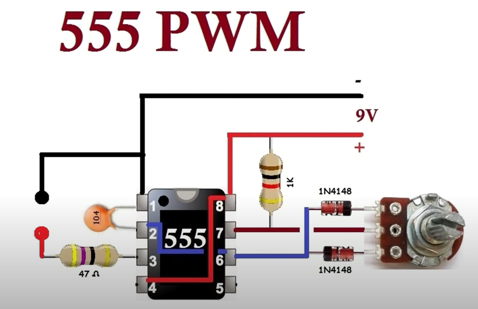

### 其他

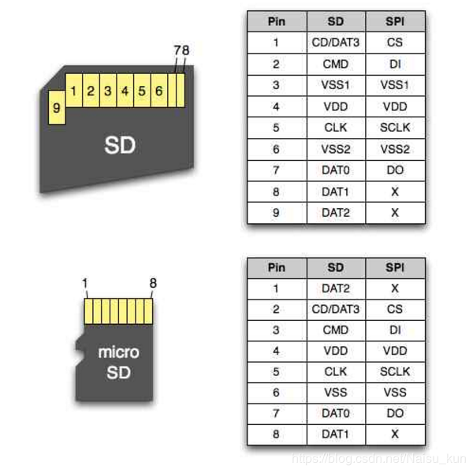
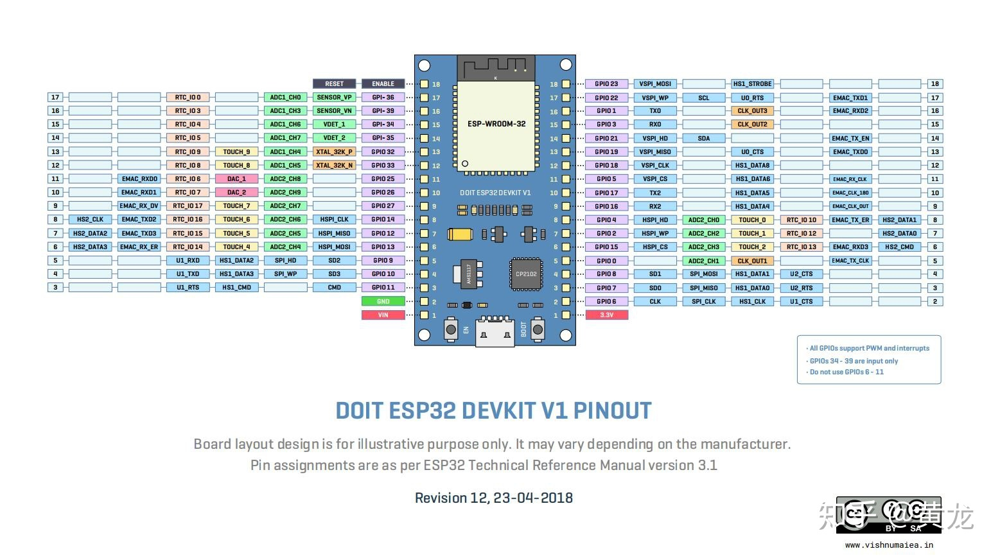


### 整流器

* G4IBC10UD 
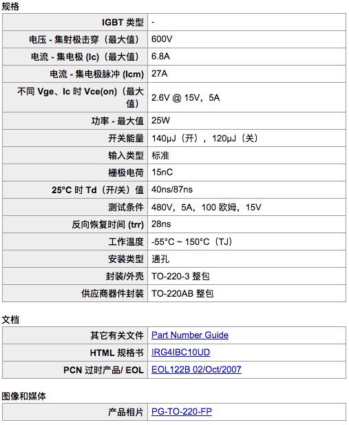
  * 649P
  * 622P
  * 620P
  * 506N
  * 513N
  * 613N
  * 618N
  * 525N
* [UGF8JT 0128, 500v-600v 8A](https://html.alldatasheetcn.com/html-pdf/62242/GE/UGF8JT/20/1/UGF8JT.html)
* [FES8JT 9312 50v-600v 8A](https://pdf1.alldatasheet.com/datasheet-pdf/view/151015/EIC/FES8JT.html)
* [F10A60 (N 3A) 50v-600v 10A](https://html.alldatasheet.com/html-pdf/849278/FORMOSA/EF10A60F/596/2/EF10A60F.html)
* [FMXG22 (44 20)](https://html.alldatasheetcn.com/html-pdf/38156/SANKEN/FMX-G22/181/1/FMX-G22.html)
* [FMXG22 (49 01)](https://html.alldatasheetcn.com/html-pdf/38156/SANKEN/FMX-G22/181/1/FMX-G22.html)
  
### 不知道
* J293(OM3)
